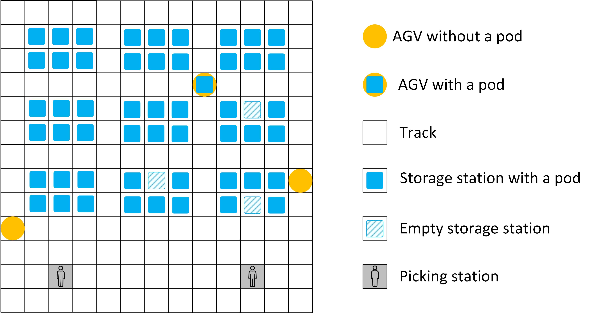
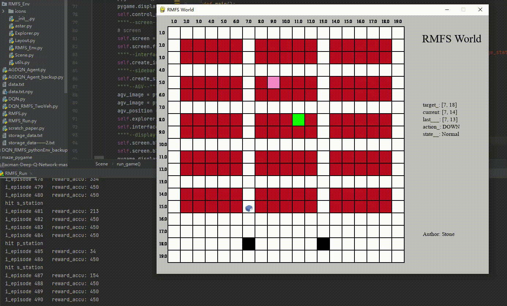

<h1 align="center">RL on Multi-AGV Collision-free Pathfinding</h1>
<h2 align="center">

[](https://github.com/vuejs/awesome-vue)

</h2>

<p align="center">
  


</p>




## Introduction

**Example: Multi-AGV controlled by neural network**

<p align="center">
</p>


**This project consists of two main parts: a multi-AGV learning environment and several reinforcement learning (RL) algorithms, including existing algorithms as well as our own innovation.**

1.The multi-AGV learning environment consists of three classes: Layout Class, which manages the layout of the scene; Explorer Class, which manages the AGVs; and Scene Class, which is a container that accommodates both the layout and AGVs so that the AGVs can operate in a specific layout.

2.As for the RL algorithms, we have implemented several well-known approaches such as Deep Q-Network (DQN), Double Deep Q-Network (DDQN), Actor-Critic (AC), and Policy-Gradient (PG), as well as our own novel algorithm, A* guiding DQN (AG-DQN).  
-*Aiming at solving pathfinding problem on a 2D map, we used a Convolutional Neural Network and specifically designed state representation.*  
-*To enhance the training effect, we applied techniques such as Behavioral Cloning, Sparse Reward, and Limited Visual.*

3.The figure on the right shows the structure of this project.

**This project was created by [LeiLuo](https://scholar.google.com/citations?user=auFJLXkAAAAJ) under the supervision of Professor Zhao Ning form University of Science and Technology of Beijing (Beijing, China)** .

## Robotic mobile and fulfilment (RMFS)
<p align="center">

</p>

1. The first figure shows an RMFS made by [Quicktron Robots](https://www.quicktron.com/). The second figure shows a model of an RMFS
2. **The components of an RMFS** include AGVs (for transferring shelves), shelves (for storing goods), a track (on which the AGVs can move), a picking station (where workers can pick goods), and a charge room (where the AGVs can recharge).
4. **The goal of the RMFS** is to have AGVs transfer shelves to the picking station, where workers can correctly select, package, and deliver the goods.
5. **The aim of the AGVs** is to transfer the necessary shelves to the picking station and return them to their original location once the workers have finished picking the goods.
6. **AGVs have a special rule** that when they are empty, they can travel under the shelves to shorten their travel path. However, when the AGVs are full, they are only allowed to move on the tracks.
7. **The objective of this project** is to develop effective methods to guide the AGVs in finding the shortest and safest path to complete a large number of tasks without collisions.

*Tips:  
-Unlike other pathfinding scenes, the RMFS is unique in that it is full of obstacles (shelves) that pose a challenge to AGVs, and the path is often too narrow to accommodate two AGVs at once.  
-Our method is not limited to the RMFS scenario but can also be applied in other pathfinding situations if they are created using a similar grip-based approach.*

## How to use
**src.main.py is the Entry of the project**
1. Create a simple Scene and control a single AGV using keyboard 
2. Create a simple Scene and let the AGV be controlled by A* algorithm 
3. Train a single AGV in a simple Scene using AG-DQN algorithm 
4. Create a simple Scene and control a single AGV using a trained neural network 

**Please note that other details will be discussed in the following sections**


## State, Action and Reward
### State
### Action
### Reward


## Convolutional Neural Network


## Behavioral Cloning


## Sparse Reward


## Limited Visual


## Other Tips
### Using our environment to test your algorithms
### How to create a special layout
### How to import a serial of task
### Each algorithm includes a simple example

### It is not sufficient in solving multi-AGV pathfinding in huge scene, it only works with small scenes and several AGVs

### Ways to improve it effect in solving multi-AGV pathfinding in huge scene


## Citation
If you find our project helpful, please cite our paper:  
[1] Luo L, Zhao N, Zhu Y, et al. A* guiding DQN algorithm for automated guided vehicle pathfinding problem of robotic mobile fulfillment systems[J]. Computers & Industrial Engineering, 2023, 178: 109112.


### Drag and Drop [__Chrome,Opera__]:-

- **Drag** the card or the card pile you want to move.
- **Drop** the dragged card pile on the target and if the move is legal card will move
- Note:- Drag and Drop doesn't work for properly for **firefox** due to their lack of support to html Drag and drop API - https://bugzilla.mozilla.org/show_bug.cgi?id=505521 .

### Click edition [__Mobile,Firefox,Chrome,Safari,Opera__]-

- **Click** on the card or card pile you want to move .The pile turns to **blue**.
- **Click** on the
  destination card and if the move is legal the cards will
  stack below the target.

## About the project.

### Drag and Drop

- Drag and drop is implemented with native html5 drag and drop api with @drag, @dragend, @dragenter eventlisteners on the Card.vue component.
- Libraries like Vue.draggable were not used as i had to write most of the drag and drop logic according to the solitaire game type and I also had to **MOVE** the stack of cards.
- Ghost image in drag is removed instead the **whole stack** of card moves with cursor change.

### CSS

- Each and every card is 100% css except the SVG of the suit in the center of the card,which is made by illustrator tool.

  <p align="center"></p>

### 3 mode menu

Choose from 3 variants of solitaire form the main menu

<p align="center"></p>

# Variants

## **Klondike**

<p align="center">

</p>
<!--  -->

## **Spider 4 Suit**

<p align="center">

</p>

## **Spider 1 Suit**

<p align="center">

</p>

## Project setup

```
npm install
npm run serve
```

## Future scope

- Add winning animation.

## Support on Beerpay

Hey dude! Help me out for a couple of :beers:!

[](https://beerpay.io/silent-lad/VueSolitaire) [](https://beerpay.io/silent-lad/VueSolitaire?focus=wish)
