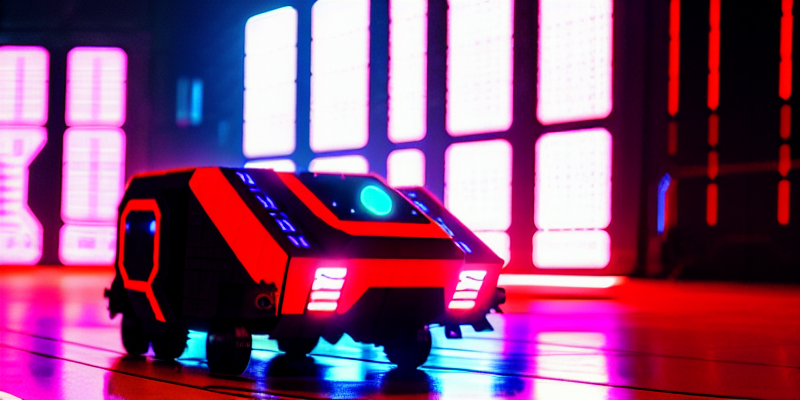
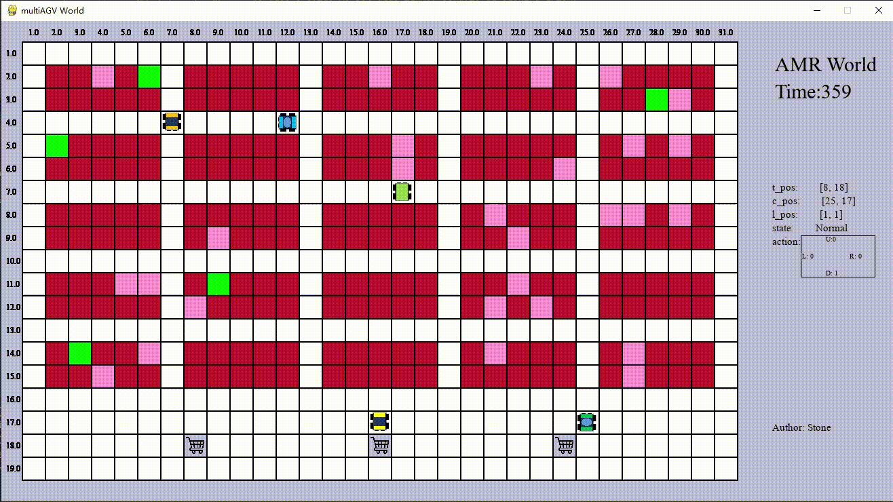
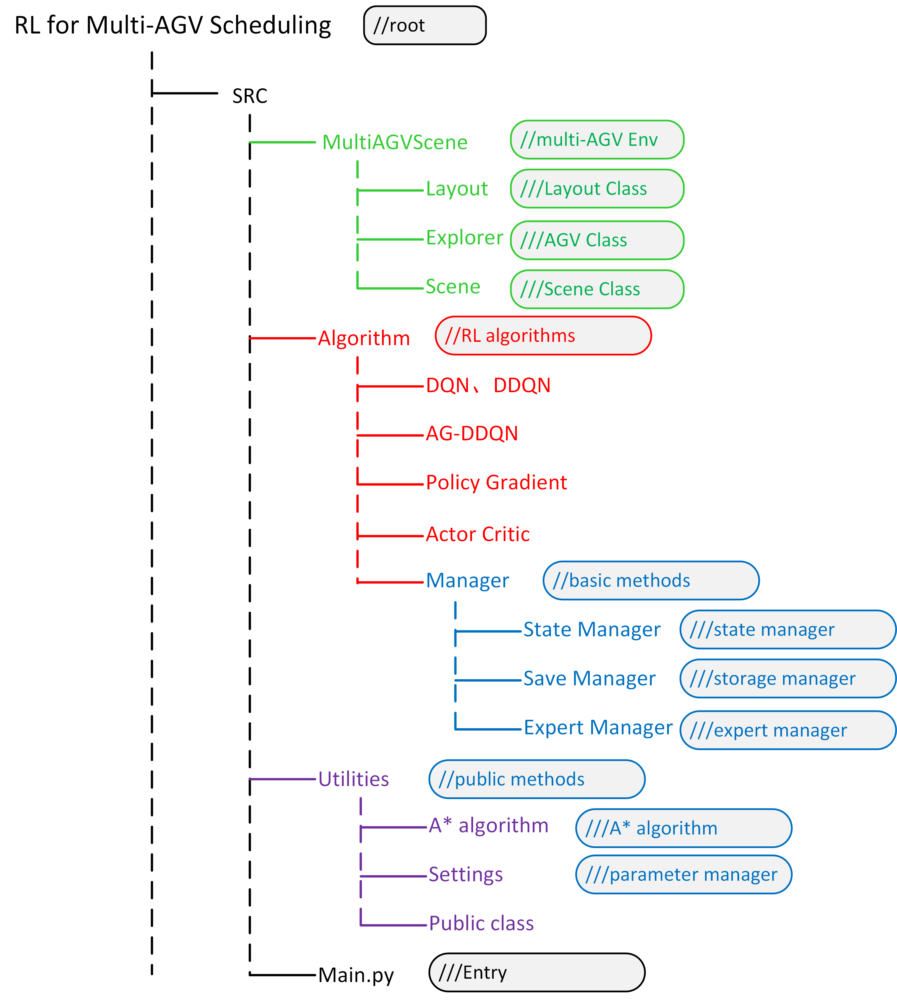
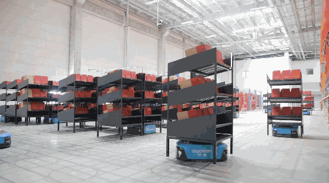
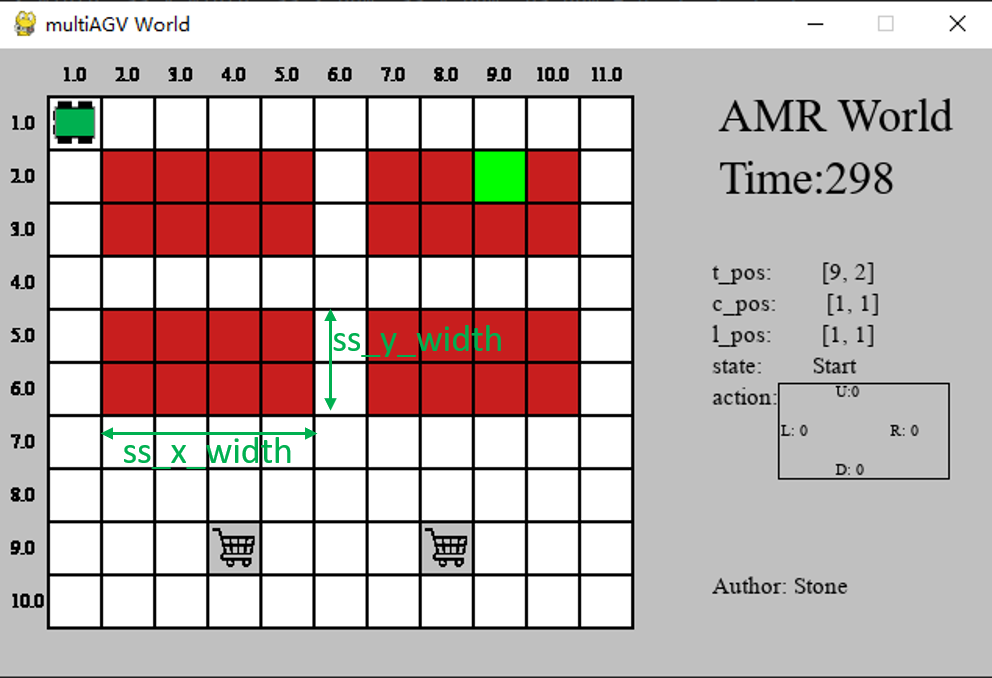

<h1 align="center">RL on Multi-AGV Collision-free Pathfinding</h1>
<h2 align="center">

[](https://github.com/vuejs/awesome-vue)

</h2>

<p align="center">
  


</p>

<p align="center">
</p>


## Introduction

**Example: Multi-AGV in an robotic mobile fulfilment system**

<p align="center">
</p>



**This project consists of two main parts: a multi-AGV learning environment and several reinforcement learning (RL) algorithms, including existing algorithms as well as our own innovation.**

1.The multi-AGV learning environment consists of three classes: Layout Class, which manages the layout of the scene; Explorer Class, which manages the AGVs; and Scene Class, which is a container that accommodates both the layout and AGVs so that the AGVs can operate in a specific layout.

2.As for the RL algorithms, we have implemented several well-known approaches such as Deep Q-Network (DQN), Double Deep Q-Network (DDQN), Actor-Critic (AC), and Policy-Gradient (PG), as well as our own novel algorithm, A* guiding DQN (AG-DQN).  
-*Aiming at solving pathfinding problem on a 2D map, we used a Convolutional Neural Network and specifically designed state representation.*  
-*To enhance the training effect, we applied techniques such as Behavioral Cloning, Sparse Reward, and Limited Visual.*

3.The figure on the right shows the structure of this project.

**This project was created by [LeiLuo](https://scholar.google.com/citations?user=auFJLXkAAAAJ) under the supervision of Professor [Zhao Ning](http://me.ustb.edu.cn/shiziduiwu/jiaoshixinxi/2022-03-24/434.html) form University of Science and Technology of Beijing (Beijing, China)** .

## Robotic Mobile Fulfilment System (RMFS)
<p align="center">


1. The figure shows an RMFS made by [Quicktron Robots](https://www.quicktron.com/).
2. **The components of an RMFS** include AGVs (for transferring shelves), shelves (for storing goods), a track (on which the AGVs can move), a picking station (where workers can pick goods), and a charge room (where the AGVs can recharge).
4. **The goal of the RMFS** is to have AGVs transfer shelves to the picking station, where workers can correctly select, package, and deliver the goods.
5. **The aim of the AGVs** is to transfer the necessary shelves to the picking station and return them to their original location once the workers have finished picking the goods.
6. **AGVs have a special rule** that when they are empty, they can travel under the shelves to shorten their travel path. However, when the AGVs are full, they are only allowed to move on the tracks.
7. **The objective of this project** is to develop effective methods to guide the AGVs in finding the shortest and safest path to complete a large number of tasks without collisions.

*Tips:  
-Unlike other pathfinding scenes, the RMFS is unique in that it is full of obstacles (shelves) that pose a challenge to AGVs, and the path is often too narrow to accommodate two AGVs at once.  
-Our method is not limited to the RMFS scenario but can also be applied in other pathfinding situations if they are created using a similar grip-based approach.*

## How to use
### 1. src.main.py is the Entry of the project  
Just run src.main.py to run this project.  
### 2. Two ways to create a scene  
<p align="center">

</p>

*Notes:  
The red block represents storage station, the gray block represents picking station, the white block represents track.  
The green block represents current target place, the pink block represents current target place's task has been finished.  
The left figure represents construction method 2.1. The right figure represents construction method 2.2*

**2.1 Create a rectangular layout by entering 5 parameters**  
Adjust following parameters to create a rectangular layout
```python
ss_x_width, ss_y_width, ss_x_num, ss_y_num, ps_num = 4, 2, 2, 2, 2
# ss_x_width: The number of storage stations in the x-axis direction of the storage station island
# ss_y_width: The number of storage stations in the y-axis direction of the storage station island
# ss_x_num: The number of storage station island in X-axis direction
# ss_y_num: The number of storage station island in y-axis direction
# ps_num: The number of picking station
```

**2.2 Create a special layout by entering 'layout_list'**  
Enter a list to create a special layout
```python
    layout_list = [[0, 0, 0, 0, 0, 0, 0, 0, 0],
                   [0, 1, 1, 1, 1, 1, 1, 0, 0],
                   [0, 1, 1, 1, 1, 1, 1, 0, 0],
                   [0, 0, 0, 0, 0, 0, 1, 1, 0],
                   [0, 0, 0, 2, 0, 0, 1, 1, 0],
                   [0, 0, 0, 0, 0, 0, 1, 1, 0],
                   [0, 1, 1, 1, 1, 1, 1, 0, 0],
                   [0, 1, 1, 1, 1, 1, 1, 0, 0],
                   [0, 0, 0, 0, 0, 0, 0, 0, 0]] 
# 0: track,  1: storage station,  2: picking station.
# Note: Any storage station needs to be connected to a road in at least one direction.
```
### 3. Five control modes of AGVs
Select the control modes by changing parameter 'control_mode'
```python
    control_type = {0: "train_NN", 1: "use_NN", 2: "A_star", 3: "manual", 4: "Expert"}
    control_mode = 3
```

**3.1 Manual mode**  
Control AGV by keyboard. (In this mode, you can only control a single AGV)
```python
    control_mode = 3
```

**3.2 A\* mode**  
Control AGV by A* algorithm.
```python
    control_mode = 2
```
**3.3 Training mode**  
Training a neural network to guide AGV. (RL algorithms will be discussed in next section)
```python
    control_mode = 0
```

**3.4 RL mode**  
Control AGV by a well-trained neural network.
```python
    control_mode = 0
```

**3.5 Expert mode**  
Collect expert experience by using A* algorithm to control AGV.
```python
    control_mode = 4
```

### 4. Three RL algorithms
We provide three algorithms including PG, AC and DQN.  
Import different packages to experience these algorithms, the control mode should choose to "Training mode"
```python
# from algorithm.AC_structure.Controller import ACAgentController as modelController
from algorithm.PG_structure.Controller import PGAgentController as modelController
# from src.algorithm.MADQN_structure.Controller import MADQNAgentController as modelController
```

## Details of RL algorithm
### 1.State
### 2.Action
### 3.Reward
### 4.Convolutional Neural Network


## Behavioral Cloning


## Sparse Reward


## Limited Visual


## Other Tips
### Using our environment to test your algorithms
### How to create a special layout
### How to import a serial of task
### Each algorithm includes a simple example

### It is not sufficient in solving multi-AGV pathfinding in huge scene, it only works with small scenes and several AGVs

### Ways to improve it effect in solving multi-AGV pathfinding in huge scene


## Citation
If you find our project helpful, please cite our paper:  
[1] Luo L, Zhao N, Zhu Y, et al. A* guiding DQN algorithm for automated guided vehicle pathfinding problem of robotic mobile fulfillment systems[J]. Computers & Industrial Engineering, 2023, 178: 109112.

